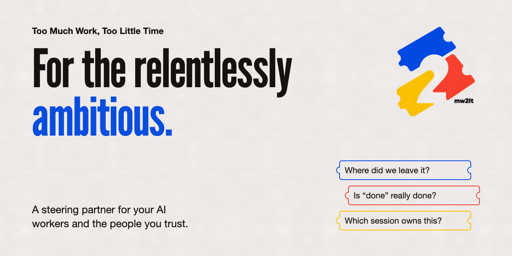

<p align="center"></p>

# 2mw2lt

**Too Much Work, Too Little Time.** For people whose work has outgrown the attention they can
give its coordination.

You run several AI coding sessions at once, across tools, accounts and machines. They carry the
tasks. 2mw2lt steers the whole undertaking: it challenges the approach, has finished work
reviewed by another vendor's model, and carries each decision and lesson into what
happens next. Only the consequential calls come back to you.

Stay in the work. Hold the standard. Keep the thread.

This repository is the plugin that connects Claude Code and Codex sessions to your workspace.

## Install

You need macOS, a repository on GitHub, and [uv](https://docs.astral.sh/uv/).

```bash
# Claude Code
claude plugin marketplace add endario/2mw2lt && claude plugin install 2mw2lt@2mw2lt --scope user

# Codex
codex plugin marketplace add endario/2mw2lt --ref main && codex plugin add 2mw2lt@2mw2lt
```

Then open your coding tool in the repository and run `/2mw2lt:install`. It signs you in at
[console.2mw2lt.com](https://console.2mw2lt.com) with a one-time code, creates the
repository's workspace, admits this machine and starts the agent that serves it. If it pauses,
choose **Connect GitHub** on your desk. Run it again at any time to resume or check.

## In a session

| | |
| --- | --- |
| `/2mw2lt:connect` | Join the workspace and stay reachable |
| `/2mw2lt:brain` | Take the steering role, so your desk talks to this session |
| `/2mw2lt:gate` | Commission an independent review of a pull request, or a critique of a design |
| `/2mw2lt:tracks` | Place work in the workspace's lanes |
| `/2mw2lt:checkpoint` | Write down what this session knows before a compact, handover or exit |
| `/2mw2lt:disconnect` | Leave cleanly |
| `/2mw2lt:rotate` | Replace a credential that has been disclosed |

## License

Source-available under the [PolyForm Strict License 1.0.0](LICENSE): free for noncommercial
use; commercial use requires a paid license. Write to hello@2mw2lt.com.

[2mw2lt.com](https://2mw2lt.com)
